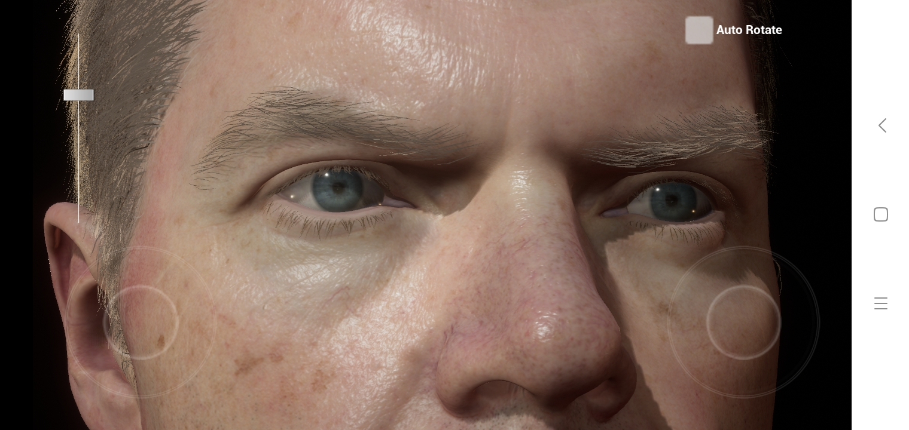

# UE4-24-3_SourceCode
此目录为引擎根目录/Engine目录下 feature- 
-MobileSkin仅预积分贴图的移动端皮肤 
-SG_SSS使用高斯函数次表面散射的移动端皮肤 

# MobileDigitalHuman - 移动端写实角色渲染
* SM5.0, ES3.1 support;
* Dynamic Lighting & Shadow;
* ImageBased Reflection;
* PreIntegrated Skin(optional);
* Custom Subsurface Scatting;
* Eye shading;
* Hair shading;
* Art Designer friendly skin materil;

# Install - 安装方式
Android : 
1. Connect your android device to computer , enable 'USB Debug';
2. Install apk in folder : '/Android_ETC1/Install_MobileDigitalHuman***.bat'
